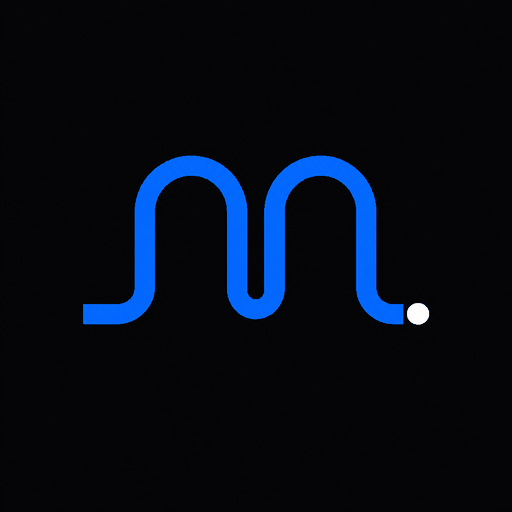

# Marathoner brand icon

**Status:** Approved
**Approved:** July 22, 2026
**Tracking issue:** [#27](https://github.com/tulloch022/marathoner/issues/27)

## Concept

The icon uses a continuous lowercase `m` shaped route to represent a first-time marathoner's path from a starting point to a finish. The white endpoint recalls the period in the `Marathoner.` wordmark.

The mark is intentionally simple so it remains recognizable in small browser tabs and inside circular community-profile crops.

## Colors

- Near-black background: `#0b0b0d`
- Marathoner blue: approximately `#2f6bff`
- Endpoint: `#ffffff`

## Files

| File | Intended use |
| --- | --- |
| `public/brand/marathoner-icon-1024.png` | Project master and highest-resolution community or social upload |
| `public/brand/marathoner-icon-512.png` | Discord and general profile use |
| `public/brand/marathoner-icon-256.png` | Medium profile use |
| `public/brand/marathoner-icon-128.png` | Small profile use |
| `public/brand/apple-touch-icon.png` | 180 pixel Apple touch icon |
| `public/brand/favicon-32.png` | 32 pixel browser favicon |
| `public/brand/favicon-16.png` | 16 pixel browser favicon |
| `public/brand/favicon.ico` | Multi-size browser fallback with 16, 32, and 48 pixel images |

## Usage

- Prefer the 512 or 1024 pixel file when a service accepts either size.
- Upload the square file directly. Services such as Discord will apply their own circular crop.
- Do not crop tightly around the route. The surrounding space protects the mark at small sizes.
- Do not stretch, rotate, recolor, outline, or add effects to the mark.

The favicon files are referenced from the application root `index.html`.

## Provenance

The project master was created with OpenAI's built-in image generator from the approved Marathoner icon direction. The requested output was a square, flat, vector-like mark with a centered blue lowercase `m` route, a small white endpoint, a near-black background, circular-crop-safe spacing, and no words or additional symbols.
