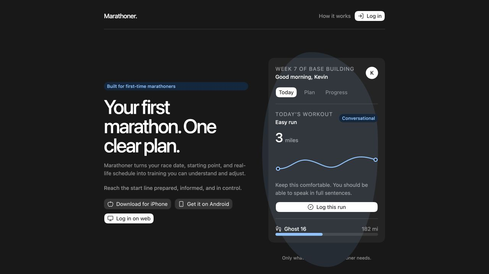
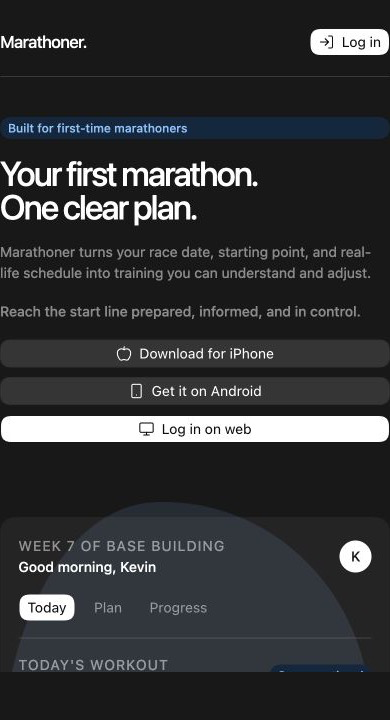

# Landing page design direction

**Status:** Approved design direction  
**Approved:** July 22, 2026  
**Product owner:** Kevin Tulloch  
**Planning issue:** [#23](https://github.com/tulloch022/marathoner/issues/23)  
**Documentation issue:** [#24](https://github.com/tulloch022/marathoner/issues/24)

## Purpose

This directory preserves the approved direction for Marathoner's future public landing page. The interactive mockup and reference images are design targets, not production application code.

Production work will be rebuilt in the existing React and TypeScript application through small, issue-linked pull requests. The mockup should not be copied into the application as one large change.

This work is outside the current Foundation milestone. The parent issue should receive an appropriate future product or launch milestone when implementation is scheduled.

## Product goals

The landing page should:

- speak directly to first-time marathoners;
- promise preparation, useful knowledge, and a sense of control;
- explain the product without requiring prior running knowledge;
- show that mobile applications are the daily training companions;
- show that the web application provides a larger space for planning and review; and
- provide separate paths for iPhone, Android, and web users.

The page should not present Marathoner as a social network, an elite coaching platform, or a general-purpose fitness application.

## Approved visual direction

The mockup preserves the visual character already established in Marathoner:

- the `Marathoner.` wordmark;
- a restrained black, white, and blue palette;
- direct typography with generous spacing;
- simple borders, rounded controls, and elevated panels;
- clear primary and secondary actions; and
- calm, specific language without unnecessary urgency.

The primary product model is **Plan. Track. Adjust.**

## Page structure

1. **Header:** Wordmark, a link to the explanation section, and web login.
2. **Hero:** First-marathon positioning, the central promise, and three platform actions.
3. **Product preview:** A realistic view of today's workout, effort guidance, shoe mileage, and product navigation.
4. **How it works:** Three focused cards for planning, tracking, and adjusting.
5. **Final platform call to action:** A clear distinction between the daily mobile experience and the more detailed web experience.

## Core content

The approved hero direction is:

> Built for first-time marathoners
>
> Your first marathon. One clear plan.
>
> Marathoner turns your race date, starting point, and real-life schedule into training you can understand and adjust.
>
> Reach the start line prepared, informed, and in control.

The three platform actions are:

- Download for iPhone
- Get it on Android
- Log in on web

The explanation section should communicate:

- **Plan around your life:** Begin with the runner's race date, experience, available days, and preferred long-run day.
- **Track what matters:** Focus on runs, perceived effort, shoes, fueling, hydration, sleep, and recovery without a social feed.
- **Adjust with confidence:** Keep small schedule changes simple, while explaining meaningful training changes and requiring approval.

## Responsive behavior

On larger screens, the hero copy and product preview sit beside one another. The explanation cards appear in a three-column row, and the final call to action balances supporting copy with platform actions.

On smaller screens, content becomes a single readable column. Platform actions expand to the available width, the product preview remains legible, and the page retains comfortable touch targets and spacing.

The mobile web experience must remain fully usable. Native mobile applications are the intended daily companions, but they are not a requirement for learning about Marathoner or logging in to the web application.

## Interaction notes

The saved mockup includes presentation-only interactions:

- iPhone and Android buttons acknowledge the selected store;
- login buttons open an illustrative login dialog; and
- Today, Plan, and Progress buttons switch the product-preview state.

These controls are not connected to authentication, application data, analytics, or app stores. They exist only to communicate the intended experience.

## Accessibility expectations

The production page should:

- use semantic landmarks and a logical heading structure;
- remain operable with a keyboard;
- provide visible focus states;
- maintain sufficient color contrast;
- include useful accessible names for controls and meaningful graphics;
- announce relevant status changes without interrupting the user;
- support reduced-motion preferences; and
- remain understandable without relying on color alone.

## Implementation principles

- Rebuild the design with the project's existing React, TypeScript, and CSS structure.
- Keep each implementation issue to an understandable 60 to 90 minute working session when practical.
- Use one focused issue branch and one reviewable pull request per slice.
- Explain each change clearly enough to review every line.
- Preserve existing authentication and application behavior while the public page is introduced.
- Run linting and the production build for every implementation pull request.
- Treat final copy as part of launch readiness. Do not imply that unavailable applications or services can already be used.

## Planned delivery slices

The parent issue defines the target. Production work should be divided into these future child issues:

1. Establish the landing-page layout and visual tokens.
2. Build the header and navigation.
3. Build the first-marathon hero section.
4. Add iPhone, Android, and web-application actions.
5. Build the workout-preview panel.
6. Build the Plan, Track, Adjust section.
7. Build the final platform call to action.
8. Complete the mobile-responsive layout.
9. Complete accessibility and keyboard review.
10. Perform final visual polish and content review.
11. Connect real store and web-application destinations when available.

Each slice should be created and scheduled when the landing page enters a future milestone. They should not be added to the Foundation milestone.

## Details still to resolve

The following decisions are intentionally not approved by this reference:

- final App Store and Google Play URLs;
- the production web-application login route;
- launch-specific availability language;
- analytics and consent behavior;
- final production imagery or illustration assets; and
- whether content changes are needed after usability review.

These details should be decided in the implementation issue where they become relevant.

## Reference files

- [`mockup.html`](./mockup.html) is the standalone interactive design reference.
- [`desktop.png`](./desktop.png) is the desktop visual reference.
- [`mobile.png`](./mobile.png) is the mobile visual reference.

Open `mockup.html` in a browser to review the interactive version. It is self-contained except for the public Lucide icon script used by the presentation.

### Desktop reference

### Mobile reference

