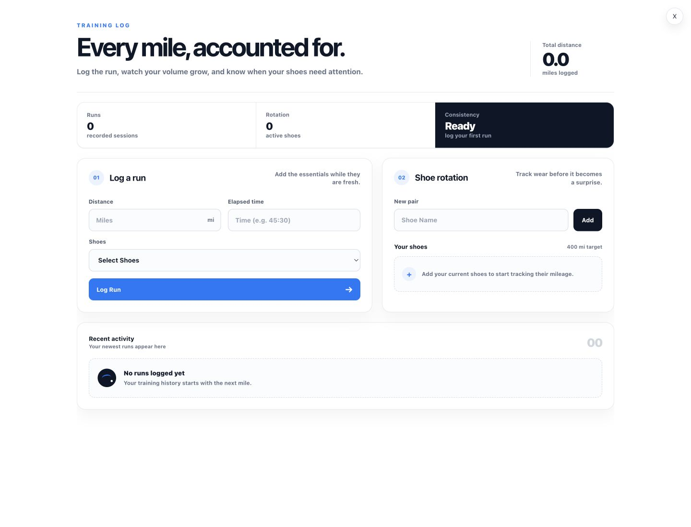
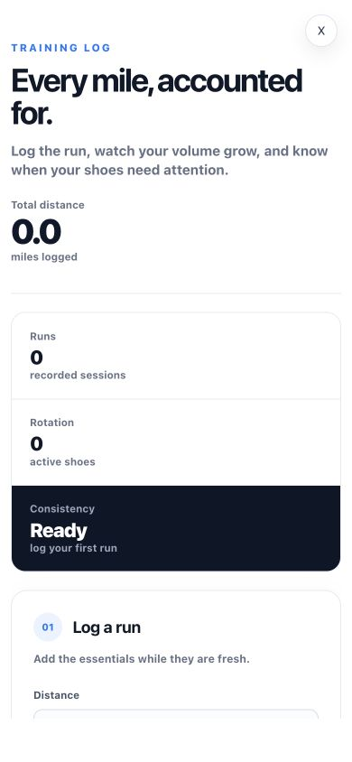
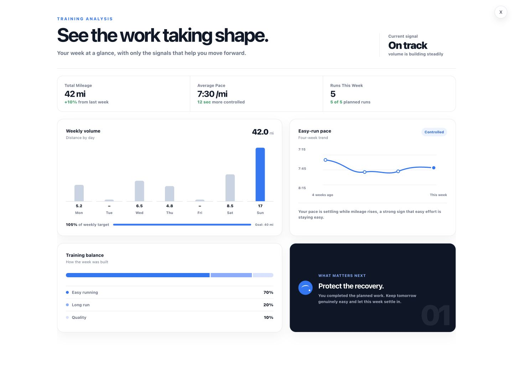
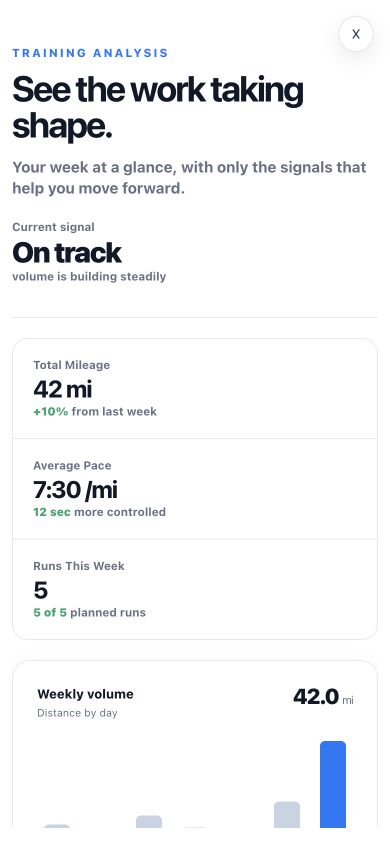

# Track and Analyze prototype direction

**Status:** Exploratory prototype, preserved for future implementation

**Captured:** July 30, 2026

**Product owner:** Kevin Tulloch

**Tracking issue:** [#43](https://github.com/tulloch022/marathoner/issues/43)

**Prototype branch:** `codex/issue-43-track-analyze-prototypes`

**Draft prototype PR:** [#44](https://github.com/tulloch022/marathoner/pull/44), preserved for reference and not intended to merge

## Purpose

This directory preserves the current visual direction for Marathoner's Track and Analyze panels. The screenshots and code on the prototype branch are references, not production-ready feature implementations.

Foundation work, beginning with the shared training domain model in issue [#11](https://github.com/tulloch022/marathoner/issues/11), should continue before these panels are connected to real training data. When implementation is scheduled, the designs should be rebuilt through small, issue-linked pull requests that are understandable and reviewable on their own.

## Shared visual direction

Both panels intentionally use:

- Marathoner's existing typeface and black, white, and blue palette;
- direct, calm language that helps a first-time marathoner feel informed and in control;
- generous spacing, restrained borders, and focused cards;
- a clear summary before detailed information;
- responsive layouts that remain useful on mobile web; and
- one prominent next action instead of a dense dashboard of choices.

The current application shell change is also intentional. Only the selected panel is rendered while it is open, which avoids nested interactive controls and gives each feature enough room to become a real application surface.

## Track panel

The Track panel is intended to make routine logging feel immediate and understandable.

### Intentional elements

- The headline, **Every mile, accounted for.**
- A total-distance signal at the top of the page
- A compact summary of recorded runs, active shoes, and consistency
- A simple run form focused on distance, elapsed time, and shoes
- A shoe-rotation area built around a visible 400-mile target
- Recent activity with a useful empty state

### Current placeholders

- Run and shoe data still come from the existing local component state
- The consistency label is presentation logic, not a calculated training signal
- The 400-mile shoe target is fixed and has not yet been modeled as a configurable rule
- Recent activity is not yet connected to the shared training domain model or persisted data

## Analyze panel

The Analyze panel is intended to answer a focused question: what does the runner need to understand about their training right now?

### Intentional elements

- The headline, **See the work taking shape.**
- A calm current signal that leads with interpretation
- A small set of high-value weekly summary metrics
- Weekly mileage, easy-run pace, and training-balance views
- A single **What matters next** recommendation
- Positive language that remains direct when training needs to change

### Current placeholders

- All displayed analytics are static demonstration data
- The 42-mile week, 7:30 average pace, five-run count, and comparison text are illustrative
- The pace trend and training balance are not calculated from recorded runs
- **On track** and **Protect the recovery** are not yet produced by approved training rules
- No recommendation in this prototype should be treated as coaching or safety logic

## Implementation boundary

Do not merge this prototype into `main` as the production implementation. The branch exists to preserve exact layout and styling decisions while the application foundation is built.

When Track and Analyze enter active development:

1. Create focused issues for the smallest useful data-backed behavior.
2. Build from the shared training model and service boundaries available at that time.
3. Preserve the visual hierarchy where it still supports real data and user needs.
4. Replace each placeholder with explicit rules, tests, and understandable empty states.
5. Validate desktop and mobile behavior before merging each slice.

## Reference files

- [`track-desktop.jpg`](./track-desktop.jpg) shows the Track panel at a desktop viewport.
- [`track-mobile.jpg`](./track-mobile.jpg) shows the top of the Track panel at a mobile viewport.
- [`analyze-desktop.jpg`](./analyze-desktop.jpg) shows the Analyze panel at a desktop viewport.
- [`analyze-mobile.jpg`](./analyze-mobile.jpg) shows the top of the Analyze panel at a mobile viewport.

### Track desktop

### Track mobile

### Analyze desktop

### Analyze mobile

